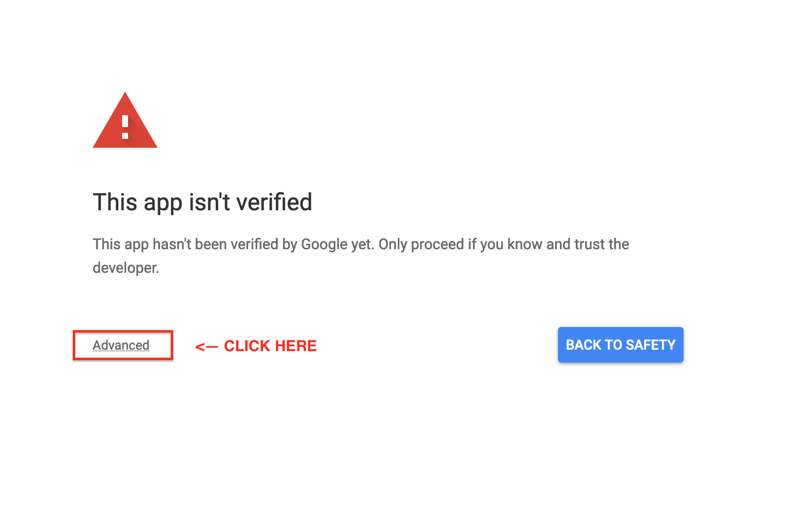
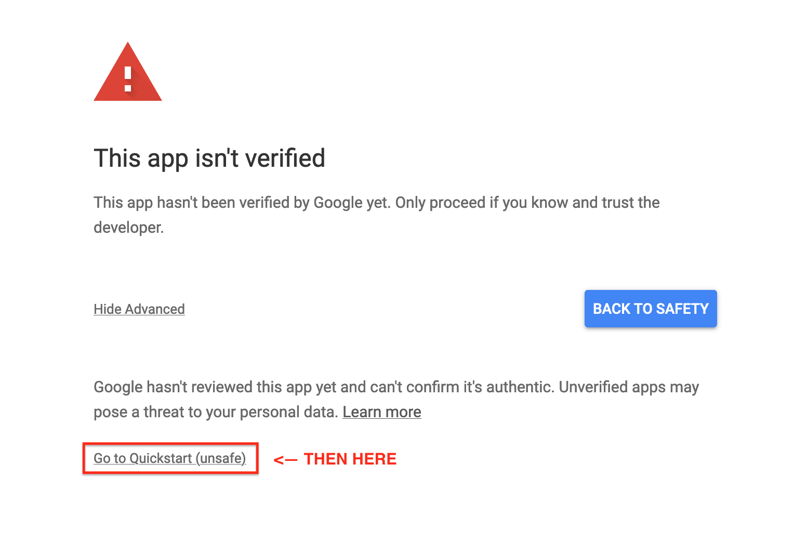
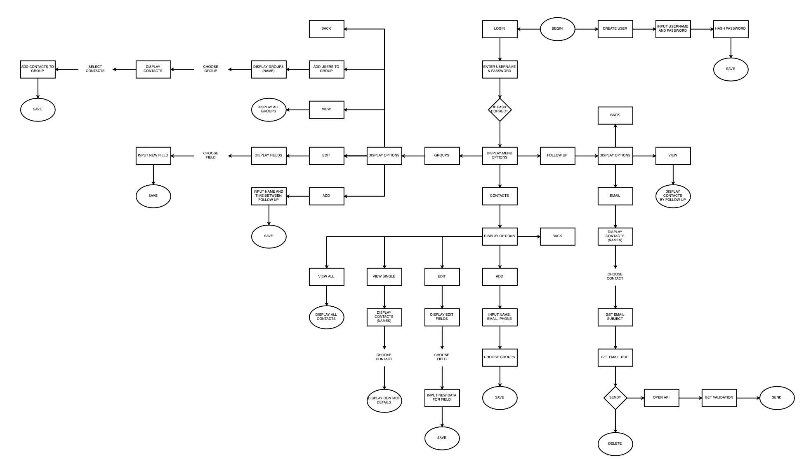
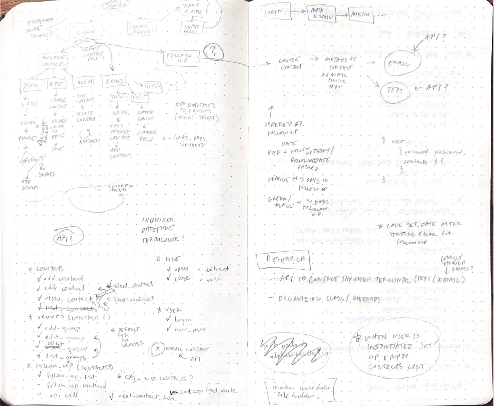

# Follow Up App

The Follow Up App is an easy to use application for storing contacts, managing follow ups, and following up.

## Installation Steps
_System Requirement_: You must have a version of Python 3 installed on your computer for this app to work.

**Within Terminal:**

Set up your desired method of python virtual environment. Activate your environment and run the following:

Navigate to the directory with the application and install dependencies:
```
$ pip install --upgrade pip
$ pip3 install -r requirements.txt
```
Within the application directory, navigate to the 'src' directory and run the application:
```
cd src
python3 main.py
```

**First Time Sending An Email:**

The first time you send an email through the app you will need to allow the application to send emails.
When you send the email a window will open in your browser. Follow the steps below to allow the application to send emails through your account:
1. Click on _'Advanced'_

2. Click on _'Go to Quickstart (unsafe)'_

3. Click _'Allow'_ on the following screens

**If you do not allow the app access to your email you will not be able to send emails through the app.**

## Software Development Plan

### Statement of Purpose and Scope
The Follow Up App provides the user with a simple and easy way to store and manage their contacts. The main functions provided by the Follow Up App are:
1. Storing contacts.
    - Contacts are inputted with first name, last name, email, phone number, and groups. These fields can be edited at any time.
    - Contacts can be viewed individually or in list format.
    - Contacts are stored in a json file.  
2. Contact grouping.
    - Contacts can be stored within groups that have a chosen number of days between contact. For example, the user could create a group called "Prospective Employers" and set the days between follow ups to 30 days. Then the user would add contacts to that group and every 30 days (from last contact) the contacts within that group are displayed to follow up with.
    - If a contact is stored in multiple groups the next date of contact will be the closest out of the groups.
3. Following up with contacts.
    - The user is able to view a list of contacts and the next scheduled follow up date (calculated using the days between contacts inputted by the user when creating their groups). If the next date of contact is within 1 day or has passed the contact is displayed in red. If the next date of contact is 2 or 3 days the contact is displayed in yellow. If the next date of contact is greater than 3 days the contact is displayed in green. If the contact is not part of a group it is displayed in black at the bottom of the list and will not have a next contact date.
    - Using the gmail API the user is able to send emails to the contacts within their stored contacts. The gmail API uses OAuth2 to validate the sending user.


### User Interaction and Experience
The user interacts with the app through a simple interface using the arrow keys. The up and down arrow keys are used to interact with the menu options while the right and left arrow keys are used to select and deselect from a list of items. The user is able to type in details of their contacts and group preferences.

### Control Flow Diagram




### Implementation Plan


